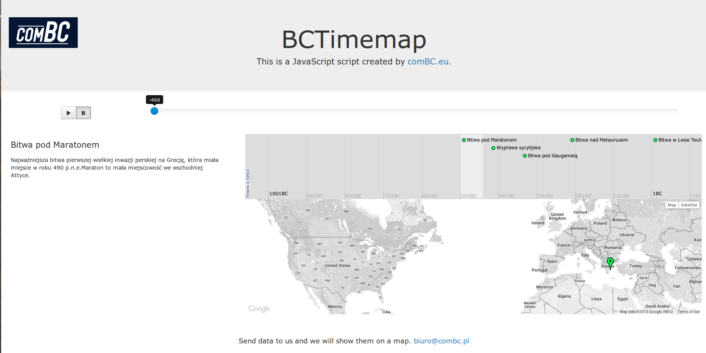

# BCTimemap
This is a JavaScript script to show point on map with time.

Mark points and their time in the json file. You will get your map that displays the animation in time.

## Screen 

## Install
1. Clone repository:

        git clone https://github.com/combc/BCTimemap.git <yourprojectname>
  
2. Run [bower][bower] install inside project directory:
 
        cd <yourprojectname>/public_html  
        bower install 
  How to install bower: [http://bower.io/][bower]

3. Open the `public_html/index.html` file.

##Usage
[TimeMap][timemap]

## License

And of course:

MIT: [LICENCE][licence]

====

> ComBC   
[http://combc.eu](http://combc.eu)

[timemap]: http://code.google.com/p/timemap/
[bower]: http://bower.io/
[licence]: ../master/LICENSE.md
